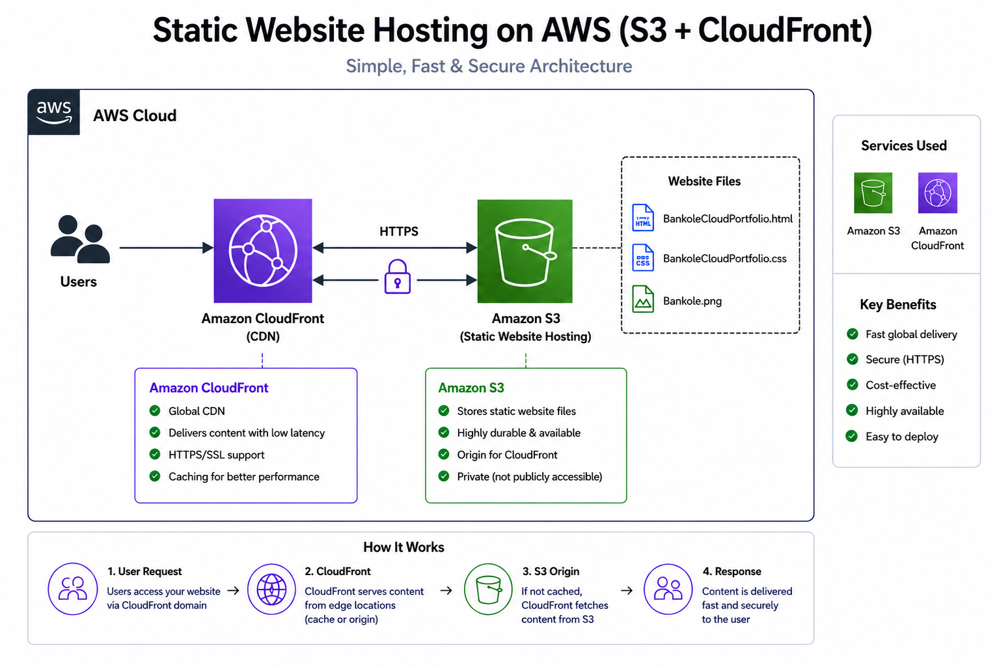
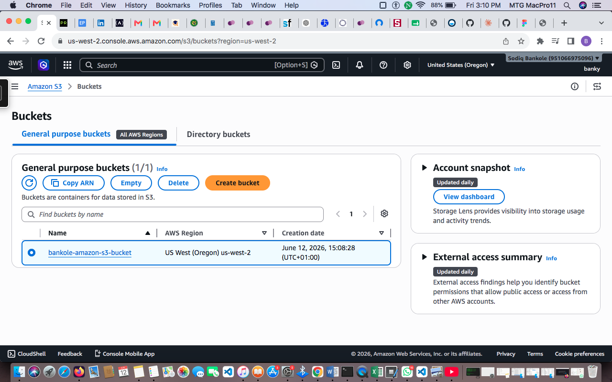
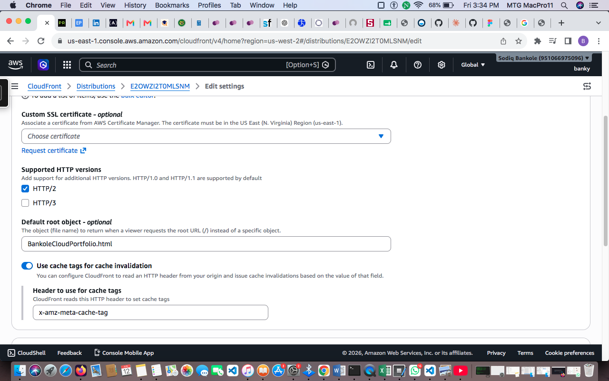

# aws-static-website-hosting
Designed and deployed a static website on AWS using Amazon S3 and CloudFront, showcasing cloud deployment, CDN integration, and website distribution best practices.
# 🌐 Static Website Hosting on AWS (S3 + CloudFront)

This project demonstrates how to deploy a fast, secure, and globally distributed static website using AWS services.

For deeper architecture understanding, see the section: Architecture Overview.

# Prerequisites
AWS account
Basic knowledge of HTML/CSS

Access to AWS Console

A static website

🚀 Architecture Overview

🔷 High-Level Architecture

# AWS Services Used
Amazon S3 — Stores website files (HTML, CSS)

Amazon CloudFront — CDN for fast global delivery

# Step 1: Create S3 Bucket (Website Storage)

Go to Amazon S3 Console

Create Bucket:

Bucket name: bankole-amazon-s3-bucket 

Region: us-west-2

⚠️ Uncheck: “Block all public access” 

Upload files:
BankoleCloudPortfolio.html
BankoleCloudPortfolio.css
bankole.png

Enable static hosting:
Properties → Static website hosting
Enable
Index document: index.html

# Step 2: Create CloudFront Distribution

Go to CloudFront Console

Create Distribution:

Origin domain: Select your S3 bucket

Origin access: Use Origin Access Control (OAC) (recommended)

Settings:

Default root object: BankoleCloudPortfolio.html

Viewer protocol policy: Redirect HTTP to HTTPS

Deploy distribution

Wait 10–15 minutes for deployment.

# Step 3: Fix S3 Permissions (IMPORTANT)

After CloudFront is created:

Update S3 bucket policy to allow only CloudFront:

{
  "Version": "2012-10-17",
  "Statement": [
    {
      "Effect": "Allow",
      "Principal": {
        "Service": "cloudfront.amazonaws.com"
      },
      "Action": "s3:GetObject",
      "Resource": "arn:aws:s3:::your-bucket-name/*",
      "Condition": {
        "StringEquals": {
          "AWS:SourceArn": "arn:aws:cloudfront::[ACCOUNT_ID]:distribution/[DISTRIBUTION_ID]"
        }
      }
    },
    {
      "Effect": "Allow",
      "Principal": "*",
      "Action": "s3:GetObject",
      "Resource": "arn:aws:s3:::your-bucket-name/*"
    }
  ]
}

# Step 4: Test Deployment

After CloudFront deploys:

Open:

https://d2jjw89e08qsse.cloudfront.net

You should see static website live globally 🌍
